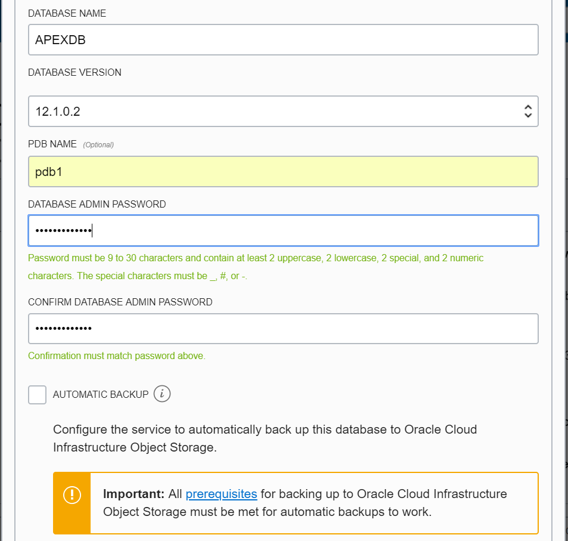
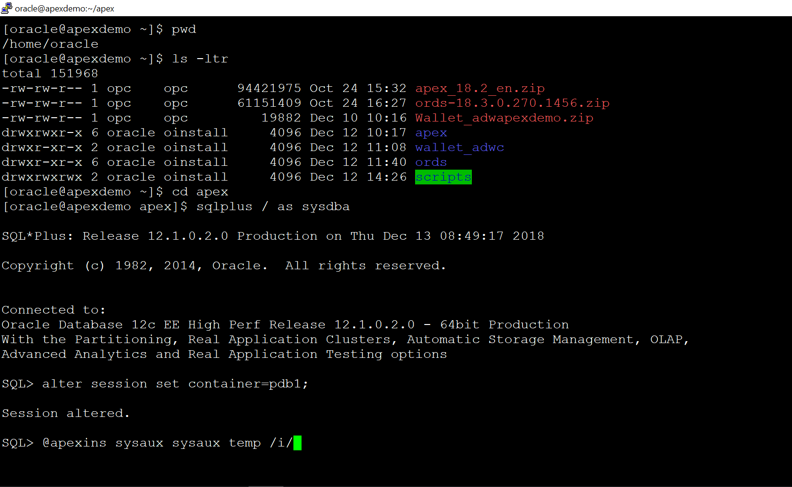
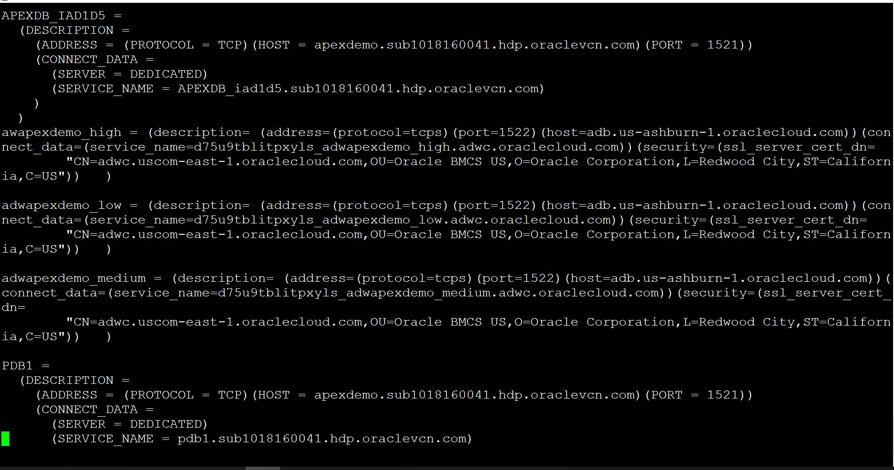
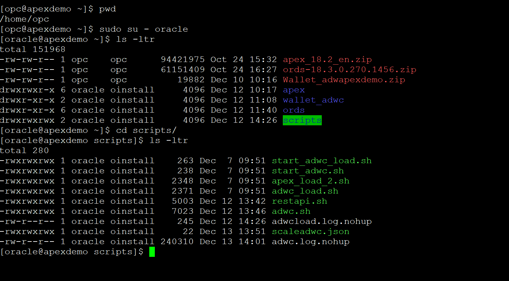

# Autonomous Data Warehouse Auto Scaling Demo Setup
 

   
   

December 11, 2018

Version 1.0

- Sambhaw Jain
(Principal Solution Engineer)
sambhaw.jain@oracle.com
- Rajesh Khatri
(Senior Solution Engineer)
rajesh.khatri@oracle.com

## Introduction

### Before you begin
#### Purpose
The purpose of this document is to help setting up the Autonomous data warehouse Auto scaling demo on your tenancy. This document covers systematic process to install the demo into any tenancy on oracle cloud.

Time to Complete
Approximately 120 minutes.

Topics covered in this document

**1. Notional Architecture of the Demo**

**2. ADWCS Provisioning**

**3. DBaaS Provisioning**

**4. APEX and ORDS Installation**

**5. Auto Scaling Demo Installation**

## Notional Architecture

#### Background

Oracle Autonomous Data Warehouse Cloud provides an easy-to-use; fully autonomous database that scales elastically delivers fast query performance and requires no database administration.

#### Easy
Fully managed cloud service that makes it very simple to provision a data warehouse, quickly and easily load data and query that data using built-in web-based tools such as notebooks.
 
Oracle’s unique autonomous database framework ensures high availability and automatic security–without requiring any additional tasks.
#### Fast
Delivers high performance data warehousing straight out-of-the-box with unparalleled scalability and reliability. Built on key Oracle Database capabilities: parallelism, columnar processing and compression. All aspects of performance tuning are automatically managed so the service requires no database tuning.
#### Elastic
Scale as needed-create and expand your data warehouse’s compute and storage capacity on demand and independently of each other with no downtime. Pay only for the resources you consume.
#### Complete
Integrates directly with the full spectrum of business analytics, data integration and IoT services within Oracle's comprehensive range of integrated cloud solutions.

#### What Do You Need?
Before starting this instruction, you should:
-	Have already procured and activated a trial or paid subscription to the following cloud services.
-	Oracle Database Cloud - Database as a Service (DBaaS). Don't have a subscription? Go to Oracle Store or [Oracle Try It](https://cloud.oracle.com/database)
-	Capacity requirement 
-	**Minimum 2 OCPU for DBaaS 256GB of storage**
-	**Minimum 5 OCPU for Autonomous Data warehouse cloud and 1 TB of storage**
-	Subscription to Oracle Autonomous Data Warehouse
-	Your Oracle Cloud user name, password, and identity domain

locate your account details in the New Account Information email that you received from Oracle Cloud when your user account was set up. If you do not have your New Account Information email, contact your account administrator.
-	Tenancy in Oracle Cloud Infrastructure, including the creation of a compartment and the setting of access to resources (see Oracle Cloud Infrastructure documentation for setting up your tenancy).
-	Oracle SQL Developer (see Oracle Technology Network download site). Version 18.3 or later. Versions 18.2 or later contain enhancements for key Autonomous Data Warehouse features. 
Note:
If you are a Windows user on 64-bit platform, download the 'Windows 64-bit with JDK 8 included' distribution as it includes the files necessary to run SQL Developer and connect to your Autonomous Data Warehouse database. 

If you are using a SQL Developer version earlier than 18.2, see the documentation topic Connecting with Oracle SQL Developer (earlier than Version 18.2).
-	Have installed PuTTY for Windows. PuTTY is available from many sites, but you can reach the main download site [Download putty](http://www.putty.org)
-	Have installed the latest version of Oracle SQL Developer from [SQL Developer Download](http://www.oracle.com/technetwork/developer-tools/sql-developer/downloads/index.html)
-	Have one of the supported browsers:
1.	Microsoft Internet Explorer: version 9 or 10; set Browser Mode to IE9 or IE10
2.	Mozilla Firefox: version 24 and later
3.	Google Chrome: version 29 and later
4.	Apple Safari: version 6

## ADWCS Provisioning
1. Login to cloud environment, Click Services to show the available services. In the list of available services, select Autonomous Data Warehouse.

2. The console for Autonomous Data Warehouse displays. You can use the List Scope drop-down menu to select a compartment; in this example the gse000#### (root) compartment is selected. Click Create Autonomous Data Warehouse.

3. In the Create Autonomous Data Warehouse dialog, enter the following information:
- Display Name - Enter a name for the data warehouse for display purposes (eg. adwapexdemo).
- Database Name - Use letters and numbers only, starting with a letter (eg. adwapexdemo). Maximum length is 14 characters. (Underscores not initially supported.)
- CPU Core Count - Number of CPUs for your service.(Minimum to be 5)
- Storage (TB) - Select your storage capacity in terabytes. It is the actual space available to your service instance, including system-related space allocations.(Minimum to be 1 TB)
- Administrator Credentials - Password (BEstrO0ng_#11) for ADMIN user of the service instance. The password must meet the following requirements:
  * The password must be between 12 and 30 characters long and must include at least one uppercase letter, one lowercase letter, and one numeric character.
  * The password cannot contain the username.
  * The password cannot contain the double quote (") character.
  * The password must be different from the last 4 passwords used.
  * The password must not be the same password that is set less than 24 hours ago.
####	License Type - Select whether you have existing licenses or if you want to subscribe to new database software licenses and the database cloud service.
- Tags - (Optional) Tagging is a metadata system that allows you to organize and track resources within your tenancy. Tags are composed of keys and values which can be attached to resources. 
- Click Create Autonomous Data Warehouse.

4. The Create Autonomous Data Warehouse dialog closes. On the console, the State field indicates that the data warehouse is Provisioning. Once creation is completed, the State field changes from Provisioning to Available.

5. Download the Credentials Zip File. Once you have created the data warehouse, download the credentials zip file for client access to that data warehouse. Click newly created instance and then select DB Connection
6. The Database Connection dialog opens for downloading client credentials. Click Download.

7. In the Download Wallet dialog, enter an encryption password (BEstrO0ng_#11) for the wallet, confirm the password, and then click Download. 

8. Click Save File, and then click OK.
9. Store the zip file and make note of the password. You will use the zip file in the next step to define a SQL Developer connection to your Autonomous Data Warehouse database.
10.	Open SQL Developer on your local computer. In the Connections panel, right-click Connections and select New Connection.

11. The New/Select Database Connection dialog appears. Enter the following information:
- Connection Name - Enter the name for this cloud connection.
- Username - Enter the database username. Use the default administrator database account (admin) that is provided as part of the service.
- Password - Enter the admin user's password that you or your Autonomous Data Warehouse administrator specified when creating the service instance.
- Connection Type - Select Cloud Wallet.
- Configuration File - Click Browse, and select the Client Credentials zip file, downloaded from the Autonomous Data Warehouse service console by you, or given to you by your Autonomous Data Warehouse administrator.
- Service - In the drop-down menu, service selections are prepended with database names. Select the low, medium, high, or parallel menu item for your database. These service levels map to the LOW, MEDIUM, HIGH, and PARALLEL consumer groups, which provide different levels of priority for your session.
Note: Earlier versions of SQL Developer may not support this feature.             

12.	Click Test. 
Status: Success displays at the left-most bottom of the New/Select Database Connection dialog.

## DBaaS Provisioning

To create database you first need to create VCN (Virtual Cloud Network) if you have already created VCN then you can skip 1-5 steps.

1. Open the navigation menu. Under Core Infrastructure,go to Networking and click Virtual Cloud Networks.
-  
2. Choose a compartment you have permission to work in (on the left side of the page). The page updates to display only the resources in that compartment. If you're not sure which compartment to use, contact an administrator
3. Click Create Virtual Cloud Network

4. Enter the following:
- Create in Compartment: Leave as is.
- Name: A friendly name for the cloud network. It doesn't have to be unique, and it cannot be changed later in the Console (but you can change it with the API). Avoid entering confidential information.
-	Create Virtual Cloud Network Plus Related Resources: Make sure this radio button is selected.

5. Click Create Virtual Cloud Network and then click close.
 
6. Generating an SSH Key Pair Using PuTTY Key Generator : When you define your Oracle DBaaS database instance, you will need to provide a secure shell (SSH) public key to establish secure connections. Perform the following steps to generate an SSH key pair using the PuTTY Key Generator on Windows.
- Find puttygen.exe in the PuTTY folder on your computer, for example, C:\Program Files (x86)\PuTTY. Double-click puttygen.exe to open it.
 
- Accept the default key type, RSA.
- Set the Number of bits in a generated key to 2048 bits, if it is not already set with that value.
- Click Generate.
- Move your mouse around the blank area to generate randomness to the key.
 
- The generated key appears under Public key for pasting into OpenSSH authorized_keys file. Copy public key in notepad we will need this while creating Dbaas provisioning.
 
- To save the key in the PuTTY PPK format, click Save private key to save the private key of the key pair.
7. Login to cloud environment, Click Services to show the available services. In the list of available services, under Database select Baremetal ,VM and Exadata
 
8. The console for Database displays. You can use the List Scope drop-down menu to select a compartment; in this example the gse00014135 (root) compartment is selected. Click Launch DB System.
9. In the Create Launch DB System dialog, enter the following information:
- Display Name - Enter a name of the database.
- Select Availability Domain
- Select Shape Type
- Select Shape
- Select Oracle Database Software Edition – Enterprise Edition
- Select Availability Storage Type – 256
- Leave Licence Included Selected
- Paste SSH public which we copied in earlier step
- Select Virtual Cloud Network (VCN which we created earlier)
- Select Client Subnet
- Give Hostname Prefix (Eg. apexdemo)
- Give Database Name (APEXDB)
- Give Database Version -12.1.0.2
- Give PDB name (pdb1)
- Give Database Admin Password (BEstrO0ng_#11): The password must meet the following requirements:
The password must be between 12 and 30 characters long and must include at least one uppercase letter, one lowercase letter, and one numeric character.
- The password cannot contain the username.
- The password cannot contain the double quote (") character.
- The password must be different from the last 4 passwords used.
- The password must not be the same password that is set less than 24 hours ago.
- Select Automatic Backup
- Click Launch DB System      

10. The Launch DB System dialog closes. On the console, the State field indicates that the data warehouse is Provisioning. When creation is completed, the State field changes from Provisioning to Available.
11. When Provisioning is completed it will show like below.

12. Now login to putty with Public IP and use private key which we saved in step 6.
13. Login as opc and then change user to oracle as show in below screen shot.
 
14. To check ORACLE_SID and ORACLE_HOME, Type below command 
cat /etc/oratab

15. Add ORACLE_SID and ORACLE_HOME in .bash_profile
- Log in as oracle user sudo su – oracle
- Edit .bash_profile. vi ~/.bash_profile
- Add below environment variable at the end of the file and save it.
  * export ORACLE_SID=APEXDB 
  * export ORACLE_HOME=/u01/app/oracle/product/12.1.0.2/dbhome_1
  * export PATH=$ORACLE_HOME/bin:$PATH
- Save the bash_profile by pressing esc and typing wq.

- Run source command 
  * source ~/.bash_profile
16. Now login to sqlplus using below command 
 - sqlplus / as sysdba
 - show pdbs;
 
17. Once you we see pdbs. Exit from sqlplus and install APEX and ORDS in Dbaas Instance.

## APEX Installation
   Approximately time 30 Minutes.
1. Login to DbaaS Instance through Putty.
- Login as opc user.
- Change user to oracle  and got to oracle home directory as below screen shot
2. Download "Oracle APEX 18.2 - English language" in local machine and then copy and unzip in oracle home directory(you can use WinSCP to copy from local to cloud instance) [APEX](http://www.oracle.com/technetwork/developer-tools/apex/downloads/index.html)

3. cd to apex directory
4. Start SQL*Plus and ensure you are connecting to your PDB and not to the "root" of the container database (APEX should not be installed at all). Run Below Command to login
- sqlplus / as sysdba
- alter session set container=pdb1;
- @apexins sysaux sysaux temp /i/
- Wait until you see sql prompt 

5. Unlock the APEX_PUBLIC_USER account and set the password.
 - alter user apex_public_user identified by BEstrO0ng_#11 account unlock;
6. Create the APEX Instance Administration user and set the password.
- begin
- apex_util.set_security_group_id( 10 );
- apex_util.create_user(p_user_name => 'ADMIN',p_email_address => 
- 'Enter your Email id',p_web_password => 'BEstrO0ng_#11',p_developer_privs =>'ADMIN' );
- apex_util.set_security_group_id( null );
- commit;
- end;
- /	
7. Run APEX REST configuration, and set the passwords of APEX_REST_PUBLIC_USER and APEX_LISTENER.
 - @apex_rest_config_core.sql ./ BEstrO0ng_#11 BEstrO0ng_#11
8. Create a network ACE for APEX (this is used when consuming Web services or sending outbound mail).
- declare
- l_acl_path varchar2(4000);
- l_apex_schema varchar2(100);
- begin
- for c1 in (select schema from sys.dba_registry where comp_id = 'APEX') loop
- l_apex_schema := c1.schema;
- end loop;sys.dbms_network_acl_admin.append_host_ace(host => '*',ace => xs$ace_type(privilege_list => xs$name_list('connect'),principal_name => l_apex_schema,principal_type => xs_acl.ptype_db));
- commit;
- end;
- /
9. Exit SQL*Plus.
	
## ORDS Installation in Dbaas Instance
      Approximately time 20 minutes.

1. Login to Dbaas Instance through Putty.
- Login as opc user.
- Change user to oracle  and got to oracle home directory as below screen shot
- run **mkdir ords** to create ords directory 
2. Download "Oracle REST Data Services" in local machine and then copy  and unzip in ords folder in oracle home directory (you can use WinSCP to copy from local to cloud instance) [ORDS](https://www.oracle.com/technetwork/developer-tools/rest-data-services/downloads/index.html)

3. Check access rule in iptables and open port for 80 and 8080.
  - iptables -I INPUT 8 -p tcp -m state --state NEW -m tcp --dport 8080 -j ACCEPT -m comment --comment "Required for    APEX."
  - service iptables save
  - iptables -t nat -I PREROUTING -p tcp --dport 80 -j REDIRECT --to-port 8080
  - service iptables save

Note:- Please add ingress rule for your VCN to allow from public internet to 8080 and 1521.

4. cd to the directory where you unzipped ORDS (ensure that ords.war is in your current directory).

5. Copy the following into the file params/ords_params.properties and replace the contents with the text below (Note:  this is the file ords_params.properties in the "params" subdirectory - a subdirectory of your current working directory).
- db.hostname=apex (Change Hostname for your Dbaas Instance)
- db.port=1521
- db.servicename=pdb1.demosubnet1.vcn1.oraclevcn.com
  ### Note: CUSTOMIZE **db.servicename** (Change service name for your Dbaas Instance. Run “lsnrctl status” to check for pdb1 and give same as servicename)
- db.username=APEX_PUBLIC_USER
- db.password=BEstrO0ng_#11
- migrate.apex.rest=false
- plsql.gateway.add=true
- rest.services.apex.add=true
- rest.services.ords.add=true
- schema.tablespace.default=SYSAUX
- schema.tablespace.temp=TEMP
- standalone.mode=TRUE
- standalone.http.port=8080
- standalone.use.https=false
### CUSTOMIZE standalone.static.images to point to the directory  containing the images directory of your APEX distribution
- standalone.static.images=/home/oracle/apex/images
- user.apex.listener.password=BEstrO0ng_#11
- user.apex.restpublic.password=BEstrO0ng_#11
- user.public.password=BEstrO0ng_#11
- user.tablespace.default=SYSAUX
- user.tablespace.temp=TEMP

6. Configure and start ORDS in stand-alone mode.  You'll be prompted for the SYS username and SYS password.kindly use the DBaaS Admin password as set above.
- java -Dconfig.dir=/home/oracle/ords -jar ords.war install simple –preserveParamFile

7. Please add ingress rule for your VCN to allow from public internet to 8080 and 1521.

8. Browse below URL to check whether ORDS is up and running.
- http://<DbaaS Instance IP address<DbaaS Instance IP address>>:8080/ords
9. Use below credentials to login.
    - Workspace : INTERNAL
    - Username  : ADMIN
    - Password  : BEstrO0ng_#11 (Admin password which you set earlier if Admin password does not work reset  password using below   step)
      
10. Change your working directory to the apex directory where you unzipped the installation software. Login to sqlPlus   and run @apxchpwd. For more information refer below Url.[Oracle Community](https://community.oracle.com/thread/2332882?start=0&tstart=0) 
11. Click sign In.

	
### ADWC Scaling Demo Installation

1. Login to Dbaas Instance through Putty.
- Login as opc user.
- Change user to oracle  and got to oracle home directory as below screen shot
2.	Set Environment variable in 
- vi ~/.bash_profile
- export ORACLE_UNQNAME=DemoDB_iad1cz (Dbaas unique name/you can check unique name at **cd 	/opt/oracle/dcs/commonstore/wallets/tde**)
- After editing the bash_profile press esc and typing wq to save. 
- source ~/.bash_profile

3. Copy ADWC wallet in oracle home directory and unzip.
-   mkdir wallet_adwc
-   unzip Wallet_adwapexdemo.zip -d wallet_adwc

4. Reset the sqlnet.ora file in the APEXDB Server environment to the following. Use WALLET_LOCATION as your ADWC unzip folder name, 
- cd /u01/app/oracle/product/12.1.0.2/dbhome_1/network/admin
- vi sqlnet.ora
- Add below property in sqlnet.ora
  * ENCRYPTION_WALLET_LOCATION=(SOURCE=(METHOD=FILE)(METHOD_DATA=(DIRECTORY=/opt/oracle/dcs/commonstore/wallets/tde/$ORACLE_UNQNAME)))
  * SQLNET.ENCRYPTION_SERVER=REQUIRED
  * SQLNET.CRYPTO_CHECKSUM_SERVER=REQUIRED
  * SQLNET.ENCRYPTION_TYPES_SERVER=(AES256,AES192,AES128)
  * SQLNET.CRYPTO_CHECKSUM_TYPES_SERVER=(SHA1)
  * ##SQLNET.ENCRYPTION_CLIENT=REQUIRED
  * ##SQLNET.CRYPTO_CHECKSUM_CLIENT=REQUIRED
  * SQLNET.ENCRYPTION_TYPES_CLIENT=(AES256,AES192,AES128)
  * SQLNET.CRYPTO_CHECKSUM_TYPES_CLIENT=(SHA1)
  * WALLET_LOCATION = (SOURCE = (METHOD = file) (METHOD_DATA = (DIRECTORY="/home/oracle/wallet_adwc")))
  * SSL_SERVER_DN_MATCH=yes
  * SQLNET.WALLET_OVERRIDE=TRUE
  * ##SSL_CLIENT_AUTHENTICATION = FALSE
  * ##SSL_VERSION = 0* 

5. Change **/u01/app/oracle/product/12.1.0.2/dbhome_1/network/admin/tnsnames.ora** file as below.  Create entry for your Dbaas PDB and copy ADWC Wallet tnsname.ora entry as below(Note: The entries in tnsnames.ora should be same as the tnsnames.ora file in the wallet zip folder obtained from ADW instance).
- APEXDB_IAD1D5 = (DESCRIPTION = (ADDRESS = (PROTOCOL = TCP)(HOST =  apexdemo.sub1018160041.hdp.oraclevcn.com)(PORT = 1521))
    (CONNECT_DATA = (SERVER = DEDICATED)
      (SERVICE_NAME = APEXDB_iad1d5.sub1018160041.hdp.oraclevcn.com)))
- adwapexdemo_high = (description= (address=(protocol=tcps)(port=1522)(host=adb.us-ashburn-1.oraclecloud.com))(connect_data=(service_name=d75u9tblitpxyls_adwapexdemo_high.adwc.oraclecloud.com))(security=(ssl_server_cert_dn=
        "CN=adwc.uscom-east-1.oraclecloud.com,OU=Oracle BMCS US,O=Oracle Corporation,L=Redwood City,ST=California,C=US"))   )
- adwapexdemo_low = (description= (address=(protocol=tcps)(port=1522)(host=adb.us-ashburn-1.oraclecloud.com))(connect_data=(service_name=d75u9tblitpxyls_adwapexdemo_low.adwc.oraclecloud.com))(security=(ssl_server_cert_dn=
        "CN=adwc.uscom-east-1.oraclecloud.com,OU=Oracle BMCS US,O=Oracle Corporation,L=Redwood City,ST=California,C=US"))   )
- adwapexdemo_medium = (description= (address=(protocol=tcps)(port=1522)(host=adb.us-ashburn-1.oraclecloud.com))(connect_data=(service_name=d75u9tblitpxyls_adwapexdemo_medium.adwc.oraclecloud.com))(security=(ssl_server_cert_dn=
        "CN=adwc.uscom-east-1.oraclecloud.com,OU=Oracle BMCS US,O=Oracle Corporation,L=Redwood City,ST=California,C=US")))
- PDB1 = (DESCRIPTION = (ADDRESS = (PROTOCOL = TCP)(HOST = apexdemo.sub1018160041.hdp.oraclevcn.com)(PORT = 1521))
    (CONNECT_DATA = (SERVER = DEDICATED)(SERVICE_NAME = pdb1.sub1018160041.hdp.oraclevcn.com)))

6. Create password less login add below credential in ADWC wallet location(where you copied your ADWC wallet in oracle home directory) for more information go through below link [Password Less Setup](https://docs.oracle.com/cd/B19306_01/network.102/b14266/cnctslsh.htm#g1033548)
- mkstore -wrl  .  -createCredential pdb1 pdbuser  BEstrO0ng_#11 (pdbuser password in Dbaas)
- mkstore -wrl  .  -createCredential adwapexdemo_high admin BEstrO0ng_#11(ADWC admin password)
- mkstore -wrl  .  -createCredential adwapexdemo_low admin BEstrO0ng_#11(ADWC admin password)
- mkstore -wrl  .  -createCredential adwapexdemo_medium admin BEstrO0ng_#11 (ADWC admin password)
- mkstore -wrl . -listCredential [password  BEstrO0ng_#11]

7. Create link and check whether password less user is working.
- SQL> sqlplus / as sysdba
- SQL> connect /@pdb1;
- SQL> Grant connect, resource,dba to pdbuser;
- SQL> drop database link adwc;
- SQL> create database link adwc connect to admin identified by "BEstrO0ng_#11" using 'aadwapexdemo_medium’;
Note : Admin password should be same as adwcs instance admin password
- SQL> alter system set global_names=FALSE scope=both sid='*’;
- SQL> select * from dual@adwc;

8. Open SQL developer (version 18.3)  and connect to your Dbaas database. Please follow below step.
- Configure SSH connection. Right click SSH Hosts and select “New SSH Host..”

- Enter Name, Host (Public IP of Dbaas intsnace), Username and give path to private key(Which you use to connect Dbaas Instance)
- 
- Click Ok
- Right click on newly created SSH Host and select “New Local Port Forward”
- Enter Name, Host(Private IP of Dbaas intsnace) and port IP

- Click Ok.
- 
- Now open Dbaas schema script "Dbaas_Pdbuser.sql"[apexdemoscript](https://github.com/sambhawjain/sambhawjain.github.io/tree/master/apexdemoscript) and go to section **change DBPROVISIONEDOCPUS** and DBPROVISIONEDOCPUS value same as number of CPU provisioned for ADW.
- Now create connection for Dbaas database and run Dbaas schema scrip "Dbaas_Pdbuser.sql"[apexdemoscript](https://github.com/sambhawjain/sambhawjain.github.io/tree/master/apexdemoscript)

9. Open Sql developer and connect to your ADWC environment and run ADWC schema script "Adwc_Schema.sql" [apexdemoscript](https://github.com/sambhawjain/sambhawjain.github.io/tree/master/apexdemoscript).

10. Download ADWCS Demo shell script(scripts folder) from GitHub and copy in oracle home directory.

11. Below are the environment information we will need to run our script.
- Tenancy OCID: Login to cloud environment, Click Services to show the available services. In the list of available services, select Administration ->Tenancy Details.

- Copy Tenancy OCID in notepad. 
- AuthuserId : Login to cloud environment, Click Services to show the available services. In the list of available services, select Identity -> Users

- Copy admin OCID in notepad as AuthuserId.
- Login to Dbaas instance and change user as oracle and run below command to generate public key PEM file to generate fingerprint for authuserid.
### https://docs.cloud.oracle.com/iaas/Content/API/Concepts/apisigningkey.htm
  * mkdir ~/.oci 
  * openssl genrsa -out ~/.oci/oci_api_key.pem 2048
  * chmod go-rwx ~/.oci/oci_api_key.pem
  * openssl rsa -pubout -in ~/.oci/oci_api_key.pem -out ~/.oci/oci_api_key_public.pem
- Open oci_api_key_public.pem file and copy the content 
- Use copied content to generate finger print for admin user
- Click the admin user for which you had taken AuthuserID and then click Add Public Key

- Paste oci_api_key_public.pem content as Public key.

- You can see new finger print as below

- Copy new fingerprint in notepad.
- Copy ADWC OCID in notepad.

12. Login to Dbaas Instance through Putty.
- Login as opc user.
- Change user to oracle  and got to oracle home directory as below screen shot
- cd /home/oracle/scripts

- Modify restapi.sh  and change tenancyId, authUserId, keyFingerprint, privateKeyPath(Give these value which we have noted in earlier step )

- Modify adwc.sh file and change oci-curl (Replace Cloud host and ADWC OCID as below)

13. Login to ORDS with user same as we have in ORDS installation.
**http://<DbaaS intance IP Address:8080/ords**

14. Click Sign in

15. Click Manage Workspace and select import.

16. Download workspace "Apex_Demo_Workspace.sql" file from git [apexdemoscript](https://github.com/sambhawjain/sambhawjain.github.io/tree/master/apexdemoscript) in local and give location
17. Click next and complete import on default value
18. Once you finish you will be able to see in Existing Workspace

19.	After importing workspace logout and again login with below credential.
 **Workspace   : pdbuser, Username    : APEXDEMO ,Password     : apexdemo**

20.	Click Sign In.

21.	Click App Builder menu and select import.

22.	Download application script "Apex_Demo_Application.sql" from [apexdemoscript](https://github.com/sambhawjain/sambhawjain.github.io/tree/master/apexdemoscript) in local and give location in Choose file. 
23.	Click Next and finish application deployment.
24.	Once you finish you can run application

